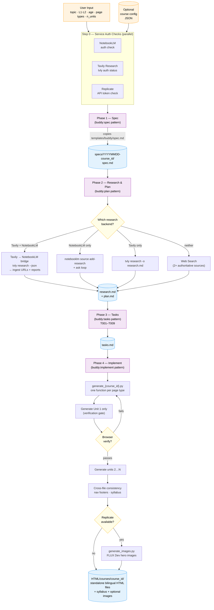

# Lesson Builder — Claude Code Skill

Generate complete, standalone bilingual courses from a single prompt. Lessons, exams, flashcards, conversations, pronunciation drills, worksheets, and syllabi — any language pair, any topic, zero dependencies.

## Install

Add the marketplace and install:

```
/plugin marketplace add ddtraveller/lesson-builder
/plugin install lesson-builder
```

Or copy directly into your skills directory:

```bash
git clone https://github.com/ddtraveller/lesson-builder.git
cp -r lesson-builder/skills/lesson-builder ~/.claude/skills/
```

## Usage

```
/lesson-builder
```

The skill walks you through setup interactively — or reads from a JSON config file for repeatable builds.

## Quickstart — Build a Real Course from One Prompt

Lesson Builder is designed to take a single high-level prompt and walk it through the full **buddy workflow** (`spec → plan → tasks → implement`) to produce a complete, research-grounded course. Here's a real worked example showing the full flow.

### 1. Give it a one-line brief

You start in Claude Code with a natural-language request:

```
Run lesson-builder and generate a TEFL course for Thai learners
of English, ages 13-14. Use HeyGen for avatar videos, FLUX for
images, and the NVIDIA NIM model from krueng.ai/tefl/avatar_chatbot.html
for the live conversation chatbot. Make it research-driven and
break from the conventions of existing children's courses.
```

That's the entire input. The skill takes it from there.

### 2. Step 0: automatic auth checks (parallel)

Before asking any questions, the skill checks every optional service in parallel and reports a status box:

```
Service Status:
- NotebookLM:      Ready (or: Unavailable — using web search)
- Tavily Research: Ready (or: Unavailable — falling back)
- Replicate:       Ready (or: Unavailable — skipping image generation)
```

If a credential is missing, the skill tries to pull it from your secrets manager
(AWS SSM Parameter Store by default — see [Optional Integrations](#optional-secrets-manager-auto-login) below).

### 3. Discovery in parallel

The skill fetches any reference URLs you mentioned (here, the avatar chatbot page to extract the exact NVIDIA model ID and Lambda endpoint), then runs **2–3 Tavily Research calls** to gather peer-reviewed evidence on the course topic. For the example above, it ran:

```bash
PYTHONIOENCODING=utf-8 tvly research \
  "evidence-based best practices teaching English ESL EFL teenagers \
   ages 13-14 CEFR A2 B1 2024 2025 research pedagogy" \
  --model pro --json -o specs/.../tavily/teen_pedagogy.json

PYTHONIOENCODING=utf-8 tvly research \
  "Thai students learning English L1 interference pronunciation \
   grammar errors common mistakes teen learners CEFR A2 B1" \
  --model pro --json -o specs/.../tavily/thai_l1_interference.json

PYTHONIOENCODING=utf-8 tvly research \
  "AI avatar chatbot conversational practice teen ESL motivation \
   engagement gamification 2024 effectiveness research" \
  --model pro --json -o specs/.../tavily/tech_engagement.json
```

In this run that produced **~71k chars of synthesized markdown across 94 cited sources** from Cambridge RECALL, MDPI, NCBI/PMC, ScienceDirect, Springer, and Thai university theses — the actual evidence base every later phase will cite.

### 4. Phase 1 — `/buddy:spec`

The skill synthesizes the discovery findings into a comprehensive natural-language brief and invokes the `buddy:spec` agent. The brief is **self-contained** because the spec-writer subagent runs in a fresh context — it includes course identity, page-type designs, AI service integration details, the exact Lambda endpoint and model ID, the 12 unit topics, the pedagogical principles to bake in (with research citations), the L1 interference targets to address, and the exact output path for `spec.md`.

You can also invoke `/buddy:spec` manually from your own brief if you want full control over the wording.

The agent reads the Tavily research files, writes `specs/{YYYYMMDD}-{course_id}/spec.md`, and pauses for your review. The skill **does not proceed until you confirm**.

### 5. Phase 2 — `/buddy:plan`

After you approve the spec, the skill invokes `buddy:plan` to produce `plan.md`. This phase also runs the **Tavily → NotebookLM bridge** (if both are authenticated): the cited Tavily reports become NotebookLM URL sources, and the synthesized markdown becomes a text source. The existing `notebooklm ask` loop then runs against the enriched corpus to generate per-unit content outlines grounded in the same sources.

If NotebookLM isn't available, the skill falls back gracefully to Tavily-standalone mode and writes the plan from the research files directly.

### 6. Phase 3 — `/buddy:tasks`

`buddy:tasks` produces `tasks.md` — the ordered T001–T0NN work breakdown. The skill enforces the **Unit 1 verification gate**: T005 generates Unit 1 only, T006 is a browser-verify checkpoint, and bulk generation (T007) only proceeds after Unit 1 has been confirmed working. This is the load-bearing rule that keeps generation reliable.

### 7. Phase 4 — `/buddy:implement`

`buddy:implement` executes the tasks in order: writes the Python generator script, runs it on Unit 1, pauses for your browser verification, then bulk-generates the remaining 11 units. Hero images go through Replicate (FLUX Dev). Avatar videos go through HeyGen. Each new chatbot page is wired to the verified NVIDIA NIM Lambda endpoint with per-unit scenario sets.

### 8. Result

For the example brief above, the run produced:

- **Spec:** `watdonchan/specs/20260407-tefl_teens_13_14/spec.md` — research-grounded, with 15 cited pedagogical principles and corpus-derived L1 targets
- **Plan + tasks:** in the same directory
- **Course output:** 60 standalone HTML files (`watdonchan/HTML/tefl/teens_13_14/`) — 12 units × 5 page types (Lesson, Live Chat, Reading + Listening, Quest Quiz, Project & Portfolio) — plus syllabus and portfolio dashboard
- **Media:** 12 HeyGen avatar videos + ~80 FLUX-generated images, served from S3 via CloudFront
- **Live chatbot:** every unit has a per-topic NVIDIA NIM scenario set wired to the production Lambda endpoint

### Key patterns

- **One prompt in, complete course out** — the skill orchestrates everything between
- **Auth-first** — every optional service is checked at Step 0, so you know upfront what you'll get
- **Pause-and-confirm at each buddy phase** — you review `spec.md` before plan, `plan.md` before tasks, `tasks.md` before implementation. No wasted generation.
- **Unit 1 verification gate** — bulk generation never runs against an unverified template
- **Research-grounded by default** — Tavily citations are the evidence base for design decisions; NotebookLM provides per-unit Q&A grounding when available
- **Pluggable backends** — every backend is optional and degrades gracefully

### Skip the discovery phase

If you already have a course config JSON, you can skip discovery and Phase 1 entirely by referencing it:

```
/lesson-builder use config/business_english.json
```

The skill loads the config, runs Step 0 auth checks, and jumps straight to the implementation phase. Useful for re-generating an existing course or building from a hand-crafted spec.

## What It Generates

Each unit produces standalone HTML/CSS/JS files with no external dependencies (except Google Fonts). Everything is bilingual — learner's language (L1) first, target language (L2) second.

| Page Type | What It Does |
|-----------|-------------|
| 📄 **Lesson** | Vocabulary cards, grammar focus, guided tutorials, section quizzes, homework |
| 📝 **Activities** | 5-6 exercises per unit with Easy/Medium/Hard difficulty badges |
| 📝 **Exam** | Interactive exam engine with difficulty selector, score tracking, and gradebook |
| 🃏 **Flashcards** | Flip cards with pronunciation audio, shuffle, keyboard navigation |
| 💬 **Conversation** | Dialogue role-play scenarios with speech bubbles and comprehension questions |
| 🔊 **Pronunciation** | Minimal pairs, listen-and-repeat drills, tongue twisters targeting L1 interference |
| 🖨️ **Worksheet** | Print-optimized exercises with hidden answer key |
| 📊 **Syllabus** | Course overview with week navigation, scope table, and assessment rubric |

## Architecture

Lesson Builder is a single Claude Code skill that orchestrates a four-phase pipeline adapted from the buddy workflow (`spec → plan → tasks → implement`). It is **auth-first, research-pluggable, and generation-gated**: every invocation begins by checking which optional services are available, then picks the highest-quality research backend that fits, then commits to a single Python generator script that produces all course HTML in one batch — but only after a Unit 1 verification gate has passed.



### Pipeline Phases

| Phase | Pattern | Produces | Purpose |
|---|---|---|---|
| **Phase 1 — Spec** | `buddy:spec` | `spec.md` | Course identity, unit breakdown, vocab lists, page types, theme, acceptance criteria. Copied from `templates/buddy/spec.md` and filled in interactively or from a config. |
| **Phase 2 — Research & Plan** | `buddy:plan` | `research.md`, `plan.md` | Cited research from the best available backend, plus an implementation plan with generator script architecture, content per unit, and risk assessment. |
| **Phase 3 — Tasks** | `buddy:tasks` | `tasks.md` | Ordered work breakdown (T001–T009). Load-bearing rule: T005 (Unit 1) and T006 (browser verify) form a hard gate before bulk generation. |
| **Phase 4 — Implement** | `buddy:implement` | Generator script + HTML output | Writes one Python script per course, runs it on Unit 1 first, verifies in browser, then bulk-generates remaining units. |

A complete worked example lives in `specs/EXAMPLE-tefl_children_10_12/` — Thai children ages 10-12, 12 units, 84 HTML files. Read it before starting a new course to see the proven shape of each artifact.

### Pluggable Research Backends

Phase 2 selects a research method automatically based on what Step 0 detected. The skill always picks the highest-quality backend that's actually available, with graceful degradation:

| Available | Method | Quality |
|---|---|---|
| Tavily Research **+** NotebookLM | **Tavily → NotebookLM bridge** — `tvly research --json` produces cited reports, citation URLs are ingested into NotebookLM as URL sources, then the existing `notebooklm ask` loop runs against the enriched corpus | Best |
| NotebookLM only | Plain `notebooklm source add-research` + `ask` loop | Good |
| Tavily only | `tvly research -o research.md`, no Q&A grounding | Good |
| Neither | Built-in web search, 2+ authoritative sources | Adequate |
| User opts for speed | Training data only | Fast but unverified |

### Generation Strategy

A single Python generator script per course (`generate_{course_id}.py`) produces all HTML files in one batch. Each page type is a function (`generate_lesson`, `generate_exam`, `generate_flashcards`, …). Pages are intentionally **standalone** — inline CSS and JS, no external bundles, no runtime dependencies beyond Google Fonts. This means every page works on any static host, in any browser, with no build step.

The Unit 1 verification gate is the load-bearing rule that keeps generation reliable: the script generates only Unit 1 first, the user opens every page in a browser to confirm interactive features work and there are no JS errors, *then* the remaining units are generated using the same templates. No bulk generation runs against an unverified template.

### Repo Layout

```
lesson-builder/
├── SKILL.md                          # The skill itself (read by Claude Code)
├── README.md                         # This file
├── NOTEBOOKLM.md                     # NotebookLM setup guide
├── CHILDREN_PAGES.md                 # Children's page-type specifications
├── IMAGE_GENERATION.md               # Replicate / FLUX Dev image generation
├── config/                           # Course config JSONs (12-week TEFL examples)
├── templates/
│   ├── *.json                        # Course config templates (business, IT, starter)
│   └── buddy/                        # Buddy workflow artifact templates
│       ├── spec.md                   # Phase 1 skeleton
│       ├── plan.md                   # Phase 2 skeleton
│       ├── tasks.md                  # Phase 3 skeleton
│       └── research.md               # Phase 2 research notes skeleton
└── specs/
    └── EXAMPLE-tefl_children_10_12/  # Complete worked example (5 artifacts)
```

## Example Use Cases

**Language Schools & TEFL Programs**
- Thai→English, Japanese→English, Spanish→English — any L1→L2 pair
- CEFR-aligned courses from Pre-A1 through B1+
- Classroom supplements with printable worksheets and exam score tracking

**Vocational & Career Training**
- English through IT — teach networking, cybersecurity, or web dev vocabulary in English
- Business English — meetings, email, presentations
- Medical or hospitality English — domain-specific vocabulary for career pathways

**Self-Paced E-Learning**
- Host on S3, GitHub Pages, or any static server — no backend required
- Full 12-week courses from a single JSON config
- One-off lessons on any topic in minutes

**Content at Scale**
- Python generator scripts produce dozens of pages at once
- JSON configs make courses repeatable and version-controlled
- Mix and match page types per unit — exams every week, flashcards for 3 random units, pronunciation drills at weeks 6, 9, and 12

## Configuration

Define a reusable course as a JSON config. Control everything — languages, page types per unit, section structure, color theme, and vocabulary targets.

```jsonc
{
  "course_id": "my_course",
  "l1": "th", "l2": "en",
  "output_dir": "HTML/courses/my_course",
  "theme": { "primary": "#f97316" },

  "page_types": {
    "lesson": "every",
    "exam": "every",
    "flashcards": "random:3",
    "conversation": "random:4",
    "pronunciation": "units:6,9,12",
    "syllabus": true
  },

  "units": [ ... ]
}
```

See [`config/schema.md`](skills/lesson-builder/config/schema.md) for the full specification and examples.

## Optional Integrations

These are not required — the skill works standalone using Claude's training data.

| Integration | What It Does |
|-------------|-------------|
| [NotebookLM](https://github.com/teng-lin/notebooklm-py) | AI-powered research to verify course content against authoritative sources |
| [Tavily Research](https://github.com/tavily-ai/skills) | Deep cited research via the `tvly` CLI; can feed citation URLs and synthesized reports directly into NotebookLM as sources |
| `fact-checker` skill | Validates grammar rules, translations, and quiz answers before generation |
| [Replicate](https://replicate.com) | AI image generation (FLUX Dev) for lesson illustrations (~$0.03/image) |

### Optional: Secrets Manager Auto-Login

If you store API keys in a secrets manager (AWS SSM Parameter Store, AWS Secrets Manager, HashiCorp Vault, GCP Secret Manager, Azure Key Vault, 1Password CLI, etc.), the skill's Step 0 auth checks can pull credentials from there automatically instead of prompting the user.

For example, with **AWS SSM Parameter Store** and the AWS CLI configured:

```bash
# In Step 0b, if `tvly auth` reports unauthenticated:
TAVILY_KEY=$(aws ssm get-parameter --name tavily --with-decryption \
  --region us-west-2 --query 'Parameter.Value' --output text 2>/dev/null)
[ -n "$TAVILY_KEY" ] && tvly login --api-key "$TAVILY_KEY"
```

Adapt the lookup line to whatever secrets backend you use. The skill's auth check just needs to end with `tvly login --api-key` (or the equivalent for NotebookLM / Replicate). This pattern keeps API keys out of `.env` files and out of shell history while still letting the skill bootstrap itself non-interactively on a fresh machine.

## Built With This

**[krueng.ai](https://krueng.ai)** — A 6-course IT career training program teaching English through technology to Thai learners at Wat Don Chan, Chiang Mai. 72 weeks of lessons, activities, and exams across Digital Foundations, IT Essentials, AI & English, Networking, Help Desk, and Security.

## License

MIT — see [LICENSE](LICENSE).
